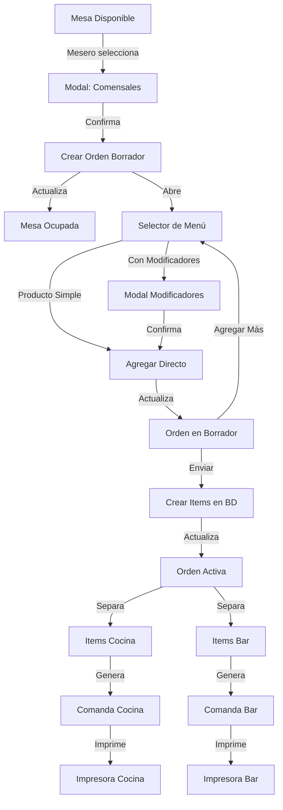

# Sistema de Toma de Pedidos - CrossFood

Sistema completo para la gestión de pedidos en restaurantes, desde la asignación de mesas hasta la generación de comandas para cocina y bar.

## 📋 Características Implementadas

### 1. Gestión de Mesas
- **Estados de Mesa**:
  - ✅ Disponible (verde)
  - 🔴 Ocupada (rojo)
  - 🔵 Reservada (azul)
- Visualización en tiempo real del estado de todas las mesas
- Información de capacidad y número de comensales

### 2. Flujo de Pedidos

#### 2.1 Asignación de Mesa
1. El mesero selecciona una mesa disponible
2. Indica el número de comensales
3. El sistema crea automáticamente una **Orden en Borrador**
4. La mesa cambia a estado "Ocupada"

#### 2.2 Selección de Productos
- Menú organizado por **categorías**
- Búsqueda rápida de productos
- Productos simples: se agregan directamente
- Productos con modificadores: se abre modal de personalización

#### 2.3 Modificadores de Productos
- **Obligatorios**: deben seleccionarse para continuar
- **Opcionales**: pueden omitirse
- Precio adicional por modificador
- Validación antes de agregar al pedido

#### 2.4 Orden en Borrador
- Vista de todos los productos agregados
- Controles de cantidad (+/-)
- Visualización de modificadores y precios
- Separación visual por destino (Cocina 🍳 / Bar 🍹)
- Cálculo automático de subtotales y total
- Opción de agregar más productos

#### 2.5 Envío de Comanda
1. Al confirmar, la orden cambia de "Borrador" a "Activo"
2. Los productos se separan por destino:
   - **Cocina**: platos y comidas
   - **Bar**: bebidas
3. Se generan **comandas (KOT)** separadas
4. Las comandas se imprimen automáticamente
5. Estado de la mesa se mantiene como "Ocupada"

### 3. Comandas (KOT - Kitchen Order Ticket)

Cada comanda incluye:
- Identificador único
- Número de mesa
- Número de comensales
- Fecha y hora
- Lista de productos con:
  - Cantidad
  - Nombre del producto
  - Modificadores seleccionados
  - Notas especiales
- Destino (Cocina o Bar)

## 🗂️ Estructura de Archivos

```
app/src/app/home/tables/
├── page.tsx                              # Página principal con mapa de mesas
├── components/
│   ├── MenuSelector.tsx                  # Selector de productos por categorías
│   ├── ModificadoresModal.tsx            # Modal para personalizar productos
│   ├── OrdenBorrador.tsx                 # Vista de orden en construcción
│   └── ComandaPrint.tsx                  # Generación e impresión de comandas
```

## 📦 Tipos Agregados

### Estados y Tipos Base
```typescript
export type EstadoOrden = 'borrador' | 'activo' | 'completado' | 'cancelado';
export type EstadoMesa = 'disponible' | 'ocupada' | 'reservada';
```

### Modificadores
```typescript
interface ModificadorOpcion {
  id: string;
  nombre: string;
  precio_adicional?: number;
}

interface Modificador {
  id: string;
  nombre: string;
  tipo: 'obligatorio' | 'opcional';
  opciones: ModificadorOpcion[];
  producto_id: string;
}

interface ModificadorSeleccionado {
  modificador_id: string;
  opcion_id: string;
  nombre_modificador: string;
  nombre_opcion: string;
  precio_adicional: number;
}
```

### Orden y Items
```typescript
interface Orden {
  id: string;
  fecha_orden: string;
  estado: EstadoOrden;
  total: number;
  notas?: string;
  restaurante_id: string;
  mesa_id?: string;
  numero_comensales?: number;
  mesero_id?: string;
  items?: OrdenItemConProducto[];
}

interface OrdenItemConProducto extends OrdenItem {
  producto?: Producto;
  destino?: 'cocina' | 'bar';
}
```

### Comandas
```typescript
interface Comanda {
  id: string;
  orden_id: string;
  mesa_numero: number;
  fecha_hora: string;
  destino: 'cocina' | 'bar';
  items: ComandaItem[];
  numero_comensales?: number;
  mesero?: string;
}
```

## 🔄 Flujo Completo



## 🎨 Características de UI/UX

### Mapa de Mesas
- Cards visuales con código de colores por estado
- Badge prominente indicando disponibilidad
- Información de capacidad y comensales actuales
- Botones contextuales según estado:
  - Disponible: **Asignar**
  - Ocupada: **Liberar**
  - Reservada: **Cancelar**

### Selector de Menú
- Sidebar con categorías
- Grid responsive de productos
- Búsqueda en tiempo real
- Indicadores de productos personalizables
- Alertas de stock bajo

### Modal de Modificadores
- Controles de cantidad (+/-)
- Radio buttons para opciones
- Indicadores obligatorio/opcional
- Cálculo de precio en tiempo real
- Validación antes de confirmar

### Orden en Borrador
- Lista detallada de productos
- Badges de destino (Cocina/Bar)
- Controles inline de cantidad
- Eliminación individual de items
- Resumen de totales
- Estadísticas por destino

## 🖨️ Sistema de Impresión

Las comandas se generan en formato HTML optimizado para impresoras térmicas de 80mm:
- Diseño monocromo con fuente monoespaciada
- Información clara y legible
- Separación visual de secciones
- Formato compacto para reducir uso de papel
- Compatible con window.print() del navegador

## 🔧 Funciones Principales

### `handleAsignarMesa(mesa)`
Inicia el flujo de pedido para una mesa disponible.

### `handleConfirmarComensales()`
Crea la orden en borrador y marca la mesa como ocupada.

### `handleAddProduct(producto, cantidad, modificadores)`
Agrega un producto a la orden en borrador con sus modificadores.

### `handleEnviarComanda()`
- Guarda los items en la base de datos
- Cambia el estado de la orden a "activo"
- Genera y imprime las comandas separadas por destino

### `imprimirComanda(comanda)`
Abre una ventana de impresión con el formato de comanda (KOT).

## ⚙️ Configuración Backend Requerida

Para que el sistema funcione completamente, asegúrate de que el backend tenga los siguientes endpoints:

- `GET /users/me` - Obtener usuario actual y su restaurante
- `GET /mesas/restaurante/:id` - Obtener mesas del restaurante
- `POST /mesas/` - Crear nueva mesa
- `PATCH /mesas/:id` - Actualizar mesa
- `DELETE /mesas/:id` - Eliminar mesa
- `GET /categorias/restaurante/:id` - Obtener categorías
- `GET /productos/categoria/:id` - Obtener productos por categoría
- `POST /ordenes/` - Crear orden
- `PATCH /ordenes/:id` - Actualizar orden
- `POST /orden-items/` - Crear item de orden

## 🚀 Próximas Mejoras Sugeridas

1. **Gestión de Modificadores Backend**
   - Crear modelos para modificadores en el backend
   - Endpoints para CRUD de modificadores
   - Asociar modificadores a productos

2. **Gestión de Órdenes Activas**
   - Vista de pedidos activos por mesa
   - Agregar productos a órdenes existentes
   - Marcar productos como servidos

3. **Historial de Pedidos**
   - Consultar pedidos anteriores
   - Estadísticas de ventas
   - Productos más vendidos

4. **Impresión Automática**
   - Integración con impresoras de red
   - Configuración de impresoras por estación
   - Cola de impresión

5. **Notificaciones**
   - Alertas en tiempo real para cocina/bar
   - Notificaciones push para personal
   - Temporizadores de preparación

6. **Gestión de Pagos**
   - Dividir cuenta
   - Múltiples formas de pago
   - Propinas

## 📝 Notas Técnicas

- Los IDs temporales en items de borrador se prefijan con `temp-` para distinguirlos de los IDs del backend
- La determinación de destino (cocina/bar) actualmente se basa en el nombre de la categoría
- Las comandas se generan con IDs únicos combinando timestamp y tipo
- El estado de mesa se gestiona en el frontend; considerar sincronización con backend

## 🐛 Troubleshooting

### Las comandas no se imprimen
- Verificar que el navegador permite ventanas emergentes
- Comprobar que la impresora está configurada correctamente
- Revisar la consola del navegador por errores

### Los productos no tienen destino correcto
- Actualizar la lógica de determinación de destino en `handleAddProduct`
- Considerar agregar campo `tipo` o `destino` en el modelo de Producto

### Error al crear orden
- Verificar que el usuario tiene un `restaurante_id` asignado
- Comprobar permisos del usuario en el backend
- Revisar logs del servidor

---

**Desarrollado para CrossFood** 🍽️
